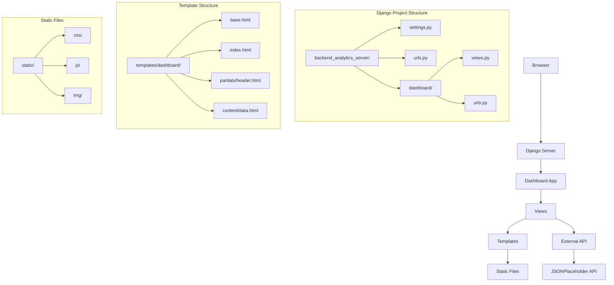

# Design Document

## Overview

El Backend Analytics Server es una aplicación Django que implementa Server Side Rendering (SSR) para mostrar un dashboard analítico moderno. La aplicación utiliza el patrón MVT (Model-View-Template) de Django, integrándose con APIs externas para obtener datos en tiempo real y presentarlos a través de una interfaz web responsive construida con Tailwind CSS.

## Architecture

### High-Level Architecture



### Request Flow

1. **User Request**: Browser solicita la página raíz
2. **URL Routing**: Django enruta la solicitud a dashboard.views.index
3. **Data Fetching**: La vista obtiene datos de JSONPlaceholder API usando requests
4. **Context Preparation**: Los datos se procesan y se preparan para el template
5. **Template Rendering**: Django renderiza las plantillas con herencia y fragmentos
6. **Response**: HTML completo se envía al browser con archivos estáticos

## Components and Interfaces

### Django Project Structure

#### backend_analytics_server (Main Project)
- **settings.py**: Configuración principal del proyecto
  - `INSTALLED_APPS`: Registro de la aplicación dashboard
  - `TEMPLATES`: Configuración de directorios de plantillas
  - `STATICFILES_DIRS`: Configuración de archivos estáticos
  - `API_URL`: URL de la API externa
- **urls.py**: Configuración de rutas principales
  - Ruta raíz ("") apunta a dashboard.urls

#### dashboard (Django App)
- **views.py**: Lógica de negocio y manejo de requests
  - `index(request)`: Vista principal que obtiene datos de API y renderiza template
- **urls.py**: Configuración de rutas de la aplicación
  - Ruta raíz ("") apunta a views.index

### Template System

#### Base Template (base.html)
- Plantilla padre que define la estructura HTML común
- Incluye referencias a archivos estáticos (CSS, JS)
- Define bloques reutilizables: ``
- Implementa diseño responsive con Tailwind CSS

#### Index Template (index.html)
- Extiende de base.html usando ``
- Define contenido específico en ``
- Incluye fragmentos usando ``

#### Template Fragments
- **partials/header.html**: Componente de encabezado reutilizable
- **content/data.html**: Componente para mostrar datos analíticos
  - Renderiza variables del contexto como `{{ title }}` y `{{ total_responses }}`

### Static Files Management

#### Directory Structure
```
static/
├── css/
│   ├── tailwind.css
│   └── tailwind.output.css
├── js/
│   ├── charts-bars.js
│   ├── charts-lines.js
│   ├── charts-pie.js
│   ├── focus-trap.js
│   └── init-alpine.js
└── img/
    ├── dashboard.png
    ├── login-office.jpeg
    └── [other images]
```

#### Static Files Configuration
- `STATIC_URL = "static/"`: URL base para archivos estáticos
- `STATICFILES_DIRS`: Apunta a la carpeta static/ en la raíz del proyecto
- Templates usan `` y `` para referenciar archivos

### External API Integration

#### JSONPlaceholder API
- **Endpoint**: `https://jsonplaceholder.typicode.com/posts`
- **Method**: GET request usando biblioteca requests
- **Response**: Lista de posts en formato JSON
- **Processing**: Cálculo de total_responses = len(posts)

#### API Configuration
- URL almacenada en `settings.API_URL` para fácil modificación
- Importación en views usando `from django.conf import settings`

## Data Models

### Context Data Structure

```python
data = {
    'title': str,           # Título del dashboard
    'total_responses': int  # Número total de respuestas de la API
}
```

### API Response Model (JSONPlaceholder)

```python
# Estructura esperada de cada post
{
    "userId": int,
    "id": int,
    "title": str,
    "body": str
}
```

## Error Handling

### API Request Errors
- **Connection Errors**: Manejo de fallos de conexión a la API externa
- **Timeout Errors**: Configuración de timeouts para requests
- **HTTP Errors**: Validación de códigos de respuesta HTTP
- **JSON Parsing Errors**: Manejo de respuestas malformadas

### Template Rendering Errors
- **Missing Templates**: Validación de existencia de archivos de plantilla
- **Context Variable Errors**: Manejo de variables no definidas en templates
- **Static Files Errors**: Validación de archivos estáticos faltantes

### Fallback Strategies
- Valores por defecto para datos de API no disponibles
- Mensajes de error amigables para el usuario
- Logging de errores para debugging

## Testing Strategy

### Unit Tests
- **Views Testing**: Verificar que las vistas retornen respuestas correctas
- **Template Rendering**: Validar que las plantillas se rendericen correctamente
- **API Integration**: Mock de requests para probar integración con API externa
- **Context Data**: Verificar que los datos se pasen correctamente a templates

### Integration Tests
- **End-to-End Flow**: Probar flujo completo desde request hasta response
- **Static Files**: Verificar que archivos estáticos se sirvan correctamente
- **Template Inheritance**: Validar herencia y fragmentos de plantillas

### Manual Testing
- **Browser Testing**: Verificar funcionalidad en diferentes navegadores
- **Responsive Design**: Probar diseño en diferentes tamaños de pantalla
- **API Connectivity**: Verificar conectividad con API externa

### Test Data
- **Mock API Responses**: Datos de prueba que simulen respuestas de JSONPlaceholder
- **Template Variables**: Datos de contexto para probar renderizado de templates
- **Static Files**: Archivos de prueba para validar carga de recursos

## Performance Considerations

### Caching Strategy
- **Template Caching**: Cache de plantillas renderizadas para mejorar performance
- **API Response Caching**: Cache temporal de respuestas de API externa
- **Static Files**: Configuración de headers de cache para archivos estáticos

### Optimization
- **Minification**: CSS y JS minificados para reducir tamaño de transferencia
- **Image Optimization**: Imágenes optimizadas para web
- **Database Queries**: Optimización de consultas (si se agregan modelos en el futuro)

## Security Considerations

### Input Validation
- **API Data**: Validación de datos recibidos de APIs externas
- **Template Variables**: Escape automático de variables en templates Django

### HTTPS Configuration
- Configuración para servir contenido sobre HTTPS en producción
- Redirección automática de HTTP a HTTPS

### Static Files Security
- Configuración segura de headers para archivos estáticos
- Prevención de acceso a archivos sensibles