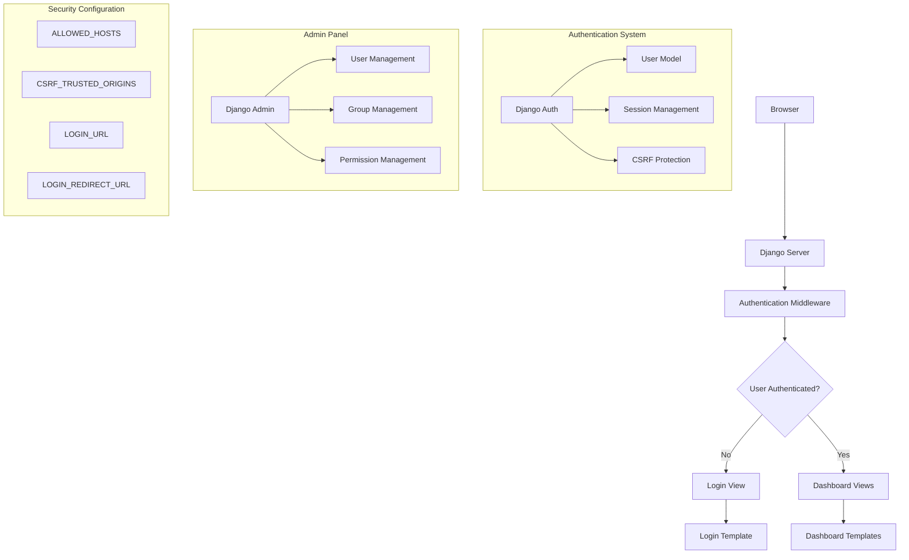

# Design Document

## Overview

El sistema de autenticación para el Backend Analytics Server utiliza el sistema de autenticación integrado de Django, proporcionando una solución robusta y segura para el control de acceso. La implementación incluye el panel de administración de Django para gestión de usuarios, formularios personalizados de login/logout, y protección de vistas mediante decoradores.

## Architecture

### High-Level Architecture



### Authentication Flow

1. **Unauthenticated Access**: Usuario intenta acceder al dashboard
2. **Redirect to Login**: @login_required redirige a /login/
3. **Login Form**: Se muestra formulario de autenticación
4. **Credential Validation**: Django valida username/password
5. **Session Creation**: Se crea sesión para usuario válido
6. **Dashboard Access**: Usuario autenticado accede al dashboard
7. **Logout Process**: Usuario puede cerrar sesión de manera segura

## Components and Interfaces

### Django Authentication System

#### User Model
- **Built-in User Model**: Utiliza django.contrib.auth.models.User
- **Fields**: username, email, password, first_name, last_name, is_active, is_staff, is_superuser
- **Authentication**: Manejo automático de hash de contraseñas
- **Sessions**: Gestión automática de sesiones de usuario

#### Authentication Views
- **LoginView**: Vista basada en clase para autenticación
  - Template: templates/security/login.html
  - Success redirect: LOGIN_REDIRECT_URL
  - Form handling: Automático con django.contrib.auth.forms.AuthenticationForm
- **LogoutView**: Vista basada en clase para cierre de sesión
  - Redirect: /login/ después del logout
  - Session cleanup: Automático

### Security Configuration

#### CSRF Protection
```python
CSRF_TRUSTED_ORIGINS = [
    "https://*.app.github.dev",  # Codespaces
    "https://localhost:8000",
    "http://127.0.0.1:8000"
]
```

#### Host Configuration
```python
ALLOWED_HOSTS = ["*"]  # Development only
```

#### Authentication URLs
```python
LOGIN_URL = '/login/'
LOGIN_REDIRECT_URL = '/'
```

### Template System

#### Login Template (templates/security/login.html)
- **Form Structure**: POST method con CSRF token
- **Input Fields**: username y password con atributos name correctos
- **Error Handling**: Mostrar form.non_field_errors para credenciales inválidas
- **Styling**: Integración con Tailwind CSS para consistencia visual

#### Header Template (templates/dashboard/partials/header.html)
- **User Display**: Mostrar {{ user.username }} cuando está autenticado
- **Logout Form**: POST form con CSRF token para logout seguro
- **Conditional Rendering**:  para mostrar/ocultar elementos

### URL Configuration

#### Main URLs (backend_analytics_server/urls.py)
```python
from django.contrib.auth import views as auth_views

urlpatterns = [
    path("admin/", admin.site.urls),
    path("", include("dashboard.urls")),
    path('login/', auth_views.LoginView.as_view(template_name='security/login.html'), name='login'),
    path('logout/', auth_views.LogoutView.as_view(next_page='/login/'), name='logout'),
]
```

#### Dashboard URLs (dashboard/urls.py)
```python
from django.contrib.auth.decorators import login_required

urlpatterns = [
    path("", login_required(views.index), name="index"),
]
```

## Data Models

### User Management

#### Superuser
- **Purpose**: Administración completa del sistema
- **Permissions**: Acceso total al Django Admin
- **Creation**: python manage.py createsuperuser

#### Regular Users (usuario01, usuario02)
- **Purpose**: Usuarios de prueba para testing
- **Permissions**: Acceso básico al dashboard
- **Creation**: A través del Django Admin panel

### Session Data
```python
# Session structure
{
    'session_key': str,
    'user_id': int,
    'expire_date': datetime,
    'session_data': dict
}
```

## Error Handling

### Authentication Errors
- **Invalid Credentials**: Mostrar mensaje "Invalid username or password"
- **Session Expired**: Redirigir automáticamente al login
- **CSRF Errors**: Protección automática con tokens
- **Permission Denied**: Redirigir a login para usuarios no autenticados

### Form Validation
- **Client-side**: HTML5 validation para campos requeridos
- **Server-side**: Django form validation automática
- **Error Display**: form.non_field_errors en template

## Security Considerations

### Password Security
- **Hashing**: Django usa PBKDF2 por defecto
- **Validation**: AUTH_PASSWORD_VALIDATORS en settings
- **Storage**: Nunca almacenar contraseñas en texto plano

### Session Security
- **Cookie Settings**: Configuración segura de cookies de sesión
- **Session Timeout**: Configuración de expiración automática
- **CSRF Protection**: Tokens CSRF en todos los formularios

### Access Control
- **View Protection**: @login_required decorator
- **Template Protection**: 
- **URL Protection**: Redirección automática para usuarios no autenticados

## Testing Strategy

### Authentication Testing
- **Login Success**: Credenciales válidas redirigen al dashboard
- **Login Failure**: Credenciales inválidas muestran error
- **Logout**: Cierre de sesión redirige al login
- **Protected Views**: Acceso sin autenticación redirige al login

### User Management Testing
- **Superuser Creation**: Verificar acceso completo al admin
- **Regular User Creation**: Verificar acceso limitado
- **Permission Testing**: Verificar restricciones de acceso

### Security Testing
- **CSRF Protection**: Verificar tokens en formularios
- **Session Management**: Verificar creación y destrucción de sesiones
- **Password Security**: Verificar hashing de contraseñas

## Performance Considerations

### Session Management
- **Database Sessions**: Usar database backend para sesiones
- **Session Cleanup**: Comando automático para limpiar sesiones expiradas
- **Cookie Optimization**: Configuración eficiente de cookies

### Authentication Caching
- **User Caching**: Cache de información de usuario frecuentemente accedida
- **Permission Caching**: Cache de permisos para reducir consultas DB

## Deployment Considerations

### Production Settings
- **ALLOWED_HOSTS**: Especificar dominios exactos en producción
- **CSRF_TRUSTED_ORIGINS**: Configurar orígenes específicos
- **SESSION_COOKIE_SECURE**: True para HTTPS
- **CSRF_COOKIE_SECURE**: True para HTTPS

### Environment Variables
- **SECRET_KEY**: Usar variable de entorno en producción
- **DEBUG**: False en producción
- **Database**: Configuración específica para producción