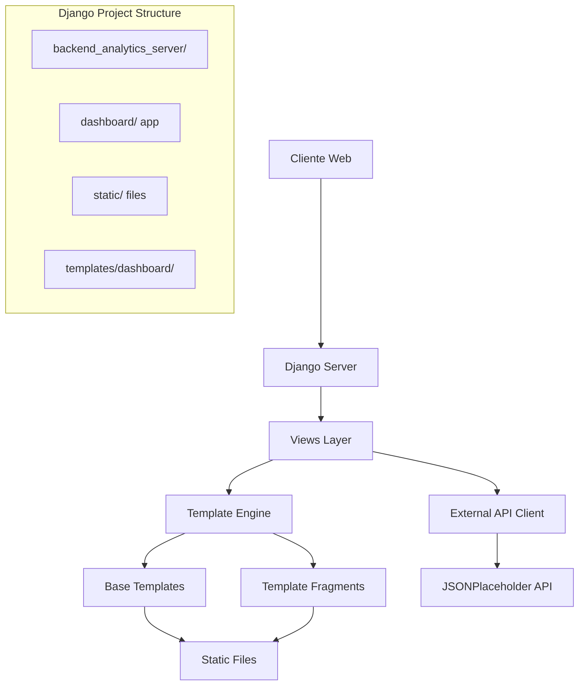

# Design Document

## Overview

El Django Data Monitor es un backend analytics server que implementa un dashboard web para monitorear datos en tiempo real. El sistema sigue exactamente la estructura y flujo especificado en la guía de desarrollo, implementando:

1. **Configuración del ambiente de desarrollo** con ambiente virtual y Django
2. **Proyecto Django** llamado `backend_analytics_server` sin aplicación inicial
3. **Aplicación dashboard** registrada en la ruta raíz ("")
4. **Sistema de plantillas** con herencia usando `` y ``
5. **Fragmentos de plantilla** con `` para modularización
6. **Renderización del lado del servidor (SSR)** con contexto dinámico
7. **Integración con APIs externas** usando el paquete `requests`
8. **Gestión de dependencias** con `requirements.txt`

La arquitectura sigue el patrón MVT (Model-View-Template) de Django, con énfasis en la implementación específica de los archivos y estructura mencionados en la guía.

## Architecture



### Core Components

1. **Django Project**: `backend_analytics_server` - Proyecto principal que contiene configuración global
2. **Dashboard App**: Aplicación principal que maneja las vistas y lógica del dashboard
3. **Template System**: Sistema de plantillas con herencia y fragmentos modulares
4. **Static Files**: Archivos CSS, JavaScript e imágenes para la interfaz
5. **External API Integration**: Cliente HTTP para consumir datos de APIs externas

## Components and Interfaces

### 1. Ambiente de Desarrollo
- **Ambiente virtual**: Creación con `python -m venv env` y activación
- **Instalación Django**: `pip install django`
- **Instalación requests**: `pip install requests` para APIs externas
- **Estructura de carpetas**: `static/` y `templates/dashboard/` en la raíz

### 2. Django Project Configuration

**File**: `backend_analytics_server/settings.py`
- Registro de aplicación `dashboard` en `INSTALLED_APPS`
- Configuración de archivos estáticos con `STATIC_URL` y `STATICFILES_DIRS`
- Configuración de plantillas con `TEMPLATES`
- Constante `API_URL = 'https://jsonplaceholder.typicode.com/posts'`

**File**: `backend_analytics_server/urls.py`
- Configuración de rutas principales
- Registro de aplicación dashboard en ruta raíz ("")

### 3. Dashboard Application

**File**: `dashboard/views.py`
```python
from django.shortcuts import render
from django.http import HttpResponse
import requests
from django.conf import settings

def index(request):
    response = requests.get(settings.API_URL)  # URL de la API
    posts = response.json()  # Convertir la respuesta a JSON
    
    # Número total de respuestas
    total_responses = len(posts)
    
    data = {
        'title': "Landing Page' Dashboard",
        'total_responses': total_responses,
    }
    
    return render(request, 'dashboard/index.html', data)
```

**File**: `dashboard/urls.py`
- Configuración de rutas específicas del dashboard
- Mapeo de vista `index` a la ruta raíz

### 4. Template System

**Base Template**: `templates/dashboard/base.html`
- Modificación del bloque content existente:
```html

<!-- START - Block content -->
<div class="flex items-center justify-center h-screen bg-gray-100 w-full">
    <div class="p-6 bg-white shadow-md rounded">
        Block content
    </div>
</div>
<!-- END - Block content -->

```
- Actualización de rutas estáticas de `./assets/` a rutas Django ``

**Index Template**: `templates/dashboard/index.html`
```html



<!-- START - Block content -->
<div class="flex flex-col flex-1 justify-center w-full">
    
    
</div>
<!-- END - Block content -->

```

**Template Fragments**:
- `templates/dashboard/partials/header.html` - Componente de encabezado con título
- `templates/dashboard/content/data.html` - Componente con métricas:
  - Variable `{{ title }}` para título secundario
  - Variable `{{ total_responses }}` para mostrar número total de respuestas

### 5. Static Files Management

**Configuración en Django**:
- Configuración de `STATIC_URL = '/static/'` en settings.py
- Configuración de `STATICFILES_DIRS` apuntando a la carpeta `static/`
- Uso de `` en plantillas
- Reemplazo de rutas `./assets/` por ``

**CSS Files**:
- `static/css/tailwind.output.css` - Estilos principales con Tailwind CSS
- `static/css/tailwind.css` - Configuración base de Tailwind

**JavaScript Files**:
- `static/js/init-alpine.js` - Inicialización de Alpine.js
- `static/js/charts-lines.js` - Componentes de gráficos para líneas
- `static/js/charts-bars.js` - Componentes de gráficos para barras
- `static/js/charts-pie.js` - Componentes de gráficos circulares
- `static/js/focus-trap.js` - Utilidades de accesibilidad

**Images**:
- Iconos SVG (github.svg, twitter.svg)
- Imágenes de interfaz (dashboard.png, login-office.jpeg, etc.)

### 5. External API Integration

**HTTP Client**: Uso del paquete `requests`
- Configuración de URLs de APIs en settings
- Manejo de respuestas JSON
- Procesamiento de datos para métricas

## Data Models

### Context Data Structure

```python
context = {
    'title': str,           # Título del dashboard
    'total_responses': int, # Número total de respuestas de API
    # Futuras métricas pueden agregarse aquí
}
```

### API Response Structure

**JSONPlaceholder Posts API**:
```json
[
    {
        "userId": int,
        "id": int,
        "title": string,
        "body": string
    }
]
```

### Template Variables

- `{{ title }}` - Título dinámico del dashboard
- `{{ total_responses }}` - Métrica de total de respuestas
- Variables de contexto adicionales según necesidades

## Error Handling

### API Request Errors

1. **Connection Errors**: Manejo de errores de conexión a APIs externas
2. **Timeout Errors**: Configuración de timeouts apropiados
3. **HTTP Status Errors**: Validación de códigos de respuesta
4. **JSON Parsing Errors**: Manejo de respuestas malformadas

### Template Rendering Errors

1. **Missing Context Variables**: Valores por defecto para variables opcionales
2. **Template Not Found**: Verificación de existencia de plantillas
3. **Static Files Not Found**: Configuración correcta de rutas estáticas

### Development Environment Errors

1. **Missing Dependencies**: Documentación clara en requirements.txt
2. **Configuration Errors**: Validación de settings.py
3. **URL Configuration**: Manejo de rutas no encontradas

## Testing Strategy

### Unit Tests

1. **View Tests**: Verificación de respuestas de vistas
2. **Template Tests**: Validación de renderización de plantillas
3. **API Integration Tests**: Pruebas de consumo de APIs externas
4. **Context Data Tests**: Verificación de datos pasados a plantillas

### Integration Tests

1. **End-to-End Template Rendering**: Pruebas completas de herencia y fragmentos
2. **Static Files Loading**: Verificación de carga de archivos estáticos
3. **API Data Flow**: Pruebas de flujo completo desde API hasta template

### Manual Testing

1. **Browser Testing**: Verificación visual en navegador
2. **Responsive Design**: Pruebas en diferentes tamaños de pantalla
3. **JavaScript Functionality**: Verificación de componentes interactivos
4. **Performance Testing**: Tiempo de carga y respuesta

### Test Environment Setup

1. **Mock APIs**: Uso de respuestas simuladas para pruebas
2. **Test Database**: Configuración de base de datos de pruebas
3. **Static Files Testing**: Verificación de archivos estáticos en tests
4. **Coverage Reports**: Medición de cobertura de código

## Implementation Considerations

### Security

- Validación de datos de APIs externas
- Configuración segura de settings.py
- Manejo seguro de archivos estáticos

### Performance

- Caching de respuestas de APIs cuando sea apropiado
- Optimización de archivos estáticos
- Lazy loading de componentes JavaScript

### Scalability

- Estructura modular de plantillas para fácil extensión
- Configuración flexible de APIs externas
- Separación clara de responsabilidades

### Maintainability

- Documentación clara de componentes
- Estructura de archivos organizada
- Código reutilizable y modular